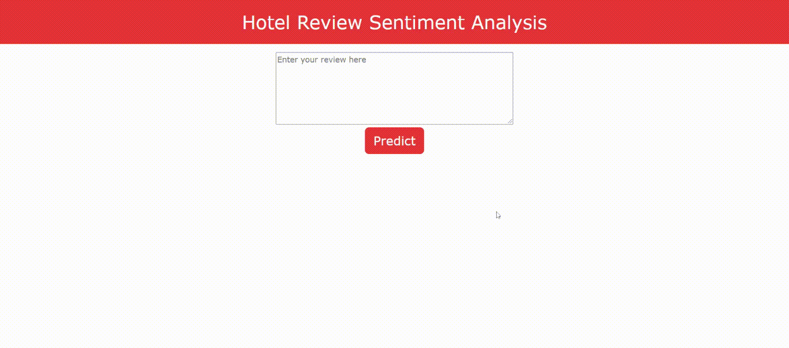

# Hotel Review Sentiment Analysis - College Project

The project is a sentiment analyser which takes hotel reviews as an input and produces a sentiment of positive or negative.

## How to run the application

- pip install -r requirements.txt 
- python app.py
- Go to http://localhost:5000 in your browser

## Machine Learning process

1. DataSet Collection
2. Text Preprocessing
3. Feature Extraction
4. Model Training
5. Metrics calculation
6. Model Deployment using Flask framework.

### 1. Dataset Collection

The dataset was collected from kaggle.com. The hotel reviews are of tripadvisor which has a total document of 32000.
The dataset was imbalanced and contained dependent features which had a 5 categorical rating from 1 to 5. Due to its imbalanced nature, It was modified
by converting the rating of 5 into positive and rating of 1 or 2 into negative.

### 2. Text Preprocessing

Various text processing was used at the time for a better accuracy
- Regular expression : Removing all the symbols and numbers except the letters.
- lowercase : Lowering all the letters.
- Tokenization : Tokenization of each sentence into words for further processing.
- Lemmatization : Performing lemmatization operation on each words.
- Stopwords : Removing the words which do not put any weight into our features.

### 3. Feature Extraction

Bag of words was used as a feature extraction mechanism dues to its simplicity and effective nature.
It forms a sparse matrix of m X n where m are the total sentence present in the cleaned dataset and n are the words present after being tokenized.
The words which are present in the sentences are being marked as 1 and the absent ones are marked as 0.

Consider the documents 
 -  'This is first document.','This is the second document.','And this is the third'

Two Steps involved : 
●	Fit : Learn a vocabulary dictionary of all tokens in the raw documents.
It returns the list of unique words present in the documents.

| and   |	document   |	first	       | is        | second |	the     |	third  |	this |
| ----- | ----------- | ------------- | --------- | ------ | ------- | ------ | ----- | 

●	Transform : Transform documents to document-term matrix.
  It returns a sparse matrix with the word present in the document as 1 and not present as 0.

|       sno       | and         |	document    |	first	       | is           | second       | 	the         |	third        |	this         |
| -----------  | ----------- | -----------  | -----------  | -----------  | -----------  | -----------  | -----------  | -----------   |
| document1     | 0	          |   1	         | 1	          | 1	           | 0	          | 0	           | 0	            | 1 |
| document2 | 0	| 1	| 0	| 1	| 1	| 1	| 0	| 1  |
| document3	| 1	| 0	| 0	| 1	| 0	| 1	| 1	| 1 | 

### 4. MODEL TRAINING

The machine learning model was trained on two supervised learning algorithm
- Naive bayes classifier
- Logistic regression

### 5. Metrics Calculation

Due to the dataset being imbalanced, we took the certain type of metrics for measuring the training accuracy
- Recall Score
- Predict Score
- Fbeta Score

Confusion Metrics was 

|  |Negative | 	Positive |
|----- | ----- | ----- |
| Negative	| 574 |	69|
|Positive |	44 |	1767 |

### 6. Model Deployment Using Flask

The model was dump using python pickle and deployed in flask.
The application was hosted on  https://sentiment-analysis-kadum.herokuapp.com/

## Modules used while training

-	Sklearn : Scikit-learn is probably the most useful library for machine learning in Python. The sklearn library contains a lot of efficient tools for machine learning and statistical modeling including classification, regression, clustering and dimensionality reduction.
-	Pandas : Pandas is a fast, powerful, flexible and easy to use open source data analysis and manipulation tool, built on top of the Python programming language.
-	Pickle : Pickle is a module in Python used for serializing and de-serializing Python objects.
-	Nltk : NLTK is a leading platform for building Python programs to work with human language data. It provides easy-to-use interfaces to over 50 corpora and lexical resources such as WordNet, along with a suite of text processing libraries for classification, tokenization, stemming, tagging, parsing, and semantic reasoning, wrappers for industrial-strength NLP libraries
-	Re : Regular expression in python

### © [kadumkomut](https://kadmon47.github.io/kadumkomut/)

# Happy Coding
